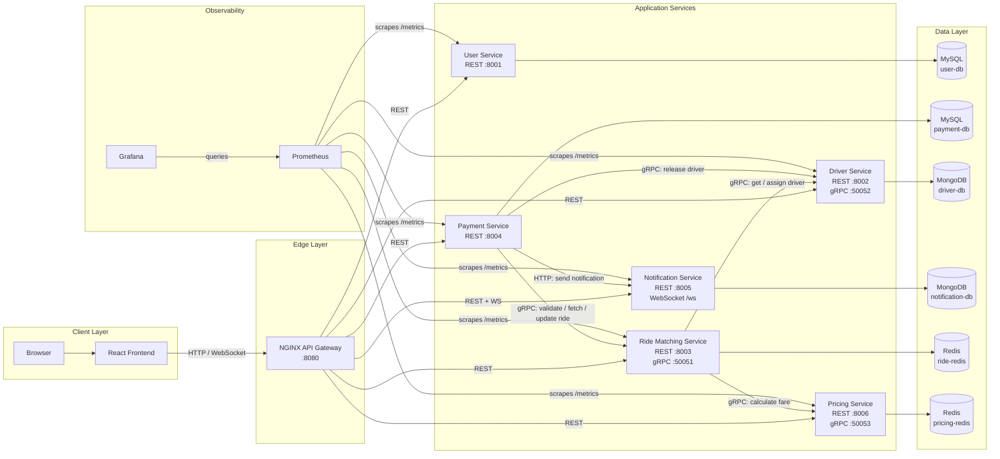
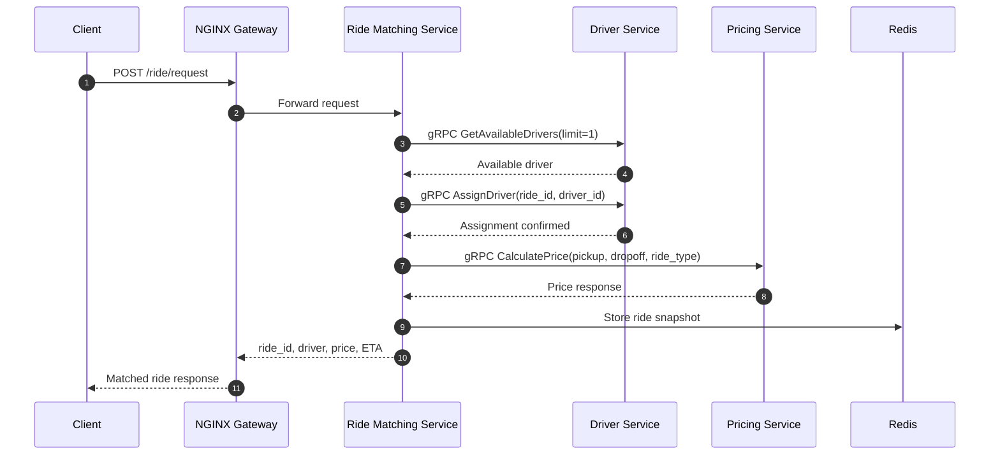
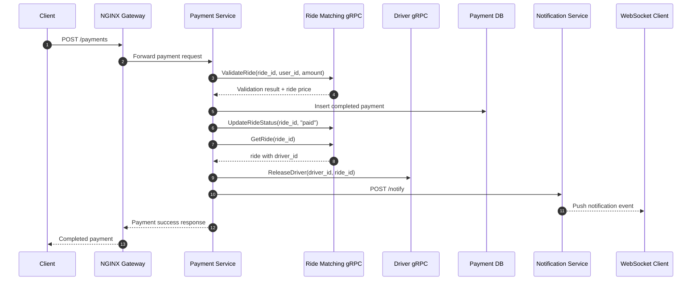

# RideBook

<div align="center">


A distributed ride-booking platform that demonstrates a practical microservices architecture with REST, gRPC, WebSockets, polyglot persistence, circuit breakers, and end-to-end observability.

</div>

## Overview

RideBook models the core workflow of a cab booking platform:

- user onboarding and management
- driver onboarding and availability tracking
- ride request and driver assignment
- fare estimation
- payment processing
- notification persistence and real-time delivery

The frontend is exposed through an NGINX gateway, while backend services communicate through a mix of REST, gRPC, and WebSockets depending on the use case.

## Highlights

- Microservices split by business capability
- FastAPI-based backend services in Python
- React frontend dashboard
- gRPC for internal service communication
- MySQL, MongoDB, and Redis used according to data access patterns
- Prometheus metrics and Grafana dashboards included
- Circuit breaker protection for critical downstream calls
- Full local environment with Docker Compose

## Architecture

### High-Level System Diagram



### Service Responsibilities

| Service | Responsibility | Storage | Interfaces |
| --- | --- | --- | --- |
| `user-service` | Rider CRUD | MySQL | REST |
| `driver-service` | Driver CRUD, availability, assignment, release | MongoDB | REST, gRPC |
| `ride-matching-service` | Ride creation and orchestration | Redis | REST, gRPC |
| `pricing-service` | Fare and surge calculation | Redis | REST, gRPC |
| `payment-service` | Payment processing and ride finalization | MySQL | REST |
| `notification-service` | Notification storage and live delivery | MongoDB | REST, WebSocket |
| `frontend` | Demo dashboard | None | Browser |
| `nginx` | Gateway and reverse proxy | None | HTTP |

## Flow Diagrams

### Ride Request Flow



### Payment Completion Flow



## Tech Stack

| Layer | Technology |
| --- | --- |
| Frontend | React 18, Axios |
| API / Services | FastAPI, Python 3 |
| Internal RPC | gRPC, Protocol Buffers |
| Gateway | NGINX |
| SQL storage | MySQL 8 |
| Document storage | MongoDB 7 |
| Cache / transient state | Redis 7 |
| Monitoring | Prometheus, Grafana |
| Local orchestration | Docker Compose |

## Repository Structure

```text
.
|-- frontend/
|-- nginx/
|-- proto/
|-- shared/
|-- user-service/
|-- driver-service/
|-- ride-matching-service/
|-- pricing-service/
|-- payment-service/
|-- notification-service/
|-- monitoring/
`-- docker-compose.yml
```

## Getting Started

### Prerequisites

- Docker
- Docker Compose

### Start the Stack

```bash
docker compose up -d --build
```

### Access Points

| Component | URL |
| --- | --- |
| Application / Gateway | `http://localhost:8080` |
| Prometheus | `http://localhost:9090` |
| Grafana | `http://localhost:3000` |
| phpMyAdmin | `http://localhost:9001` |
| Mongo Express `driver-db` | `http://localhost:9002` |
| Mongo Express `notification-db` | `http://localhost:9003` |
| RedisInsight | `http://localhost:9004` |

### Default Credentials

| Tool | Username | Password |
| --- | --- | --- |
| Grafana | `admin` | `admin` |
| Mongo Express | `admin` | `admin123` |
| phpMyAdmin | `root` | `password` |

## API Surface

The gateway exposes these main route groups:

| Capability | Route prefix |
| --- | --- |
| Users | `/users` |
| Drivers | `/drivers` |
| Ride management | `/ride`, `/rides` |
| Pricing | `/pricing` |
| Payments | `/payments` |
| Notifications | `/notifications`, `/notify`, `/ws` |
| Health checks | `/health`, `/health/users`, `/health/drivers`, `/health/rides`, `/health/payments`, `/health/notifications`, `/health/pricing` |

### Example Requests

Create a ride:

```bash
curl -X POST http://localhost:8080/ride/request \
  -H "Content-Type: application/json" \
  -d "{\"riderId\":1,\"pickup\":\"Campus\",\"dropoff\":\"Railway Station\",\"ride_type\":\"standard\"}"
```

Process a payment:

```bash
curl -X POST http://localhost:8080/payments \
  -H "Content-Type: application/json" \
  -d "{\"rideId\":\"ride-12345678\",\"userId\":1,\"amount\":25.0,\"payment_method\":\"card\"}"
```

WebSocket endpoints:

```text
ws://localhost:8080/ws
ws://localhost:8080/ws/1
```

## Internal Contracts

The protocol buffer definition in `proto/ride.proto` defines:

- `RideService`
  - `GetRide`
  - `ValidateRide`
  - `UpdateRideStatus`
- `DriverService`
  - `GetAvailableDrivers`
  - `AssignDriver`
  - `ReleaseDriver`
- `PricingService`
  - `CalculatePrice`

## Observability and Resilience

### Metrics

Each FastAPI service exposes Prometheus metrics at `/metrics`, including:

- HTTP request count and latency
- in-flight request gauges
- circuit breaker state and transition metrics
- notification WebSocket connection count

### Circuit Breakers

Circuit breakers are implemented in shared code and protect downstream calls in:

- `ride-matching-service`
  - driver lookup and assignment dependency
  - pricing dependency
- `payment-service`
  - ride validation, lookup, and update
  - driver release
  - notification delivery

Operational breaker snapshots are exposed by:

- `/circuit-breakers` on `ride-matching-service`
- `/circuit-breakers` on `payment-service`

## Development Notes

- Services bootstrap their own schema or seed data on startup.
- Ride data is stored in Redis with a one-hour TTL.
- Pricing responses are cached briefly in Redis.
- The current system is optimized for local demonstration and academic study rather than production deployment.

## License

This repository does not currently include a license file. Add one before publishing or redistributing the project externally.
