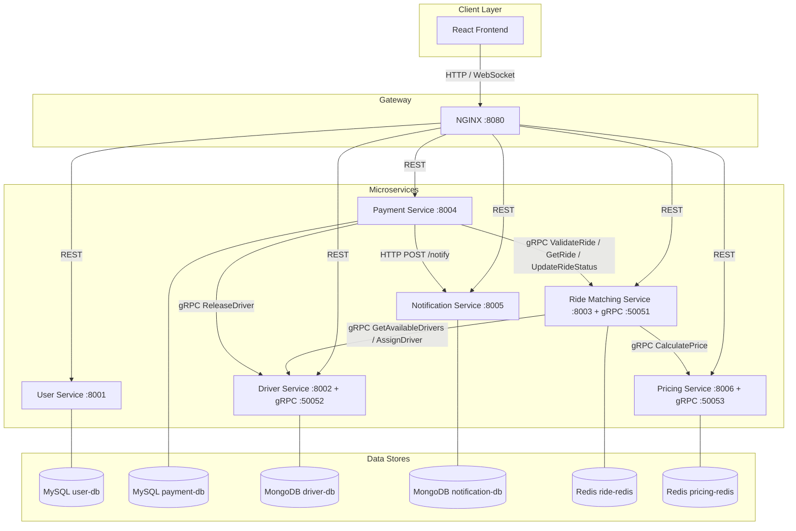
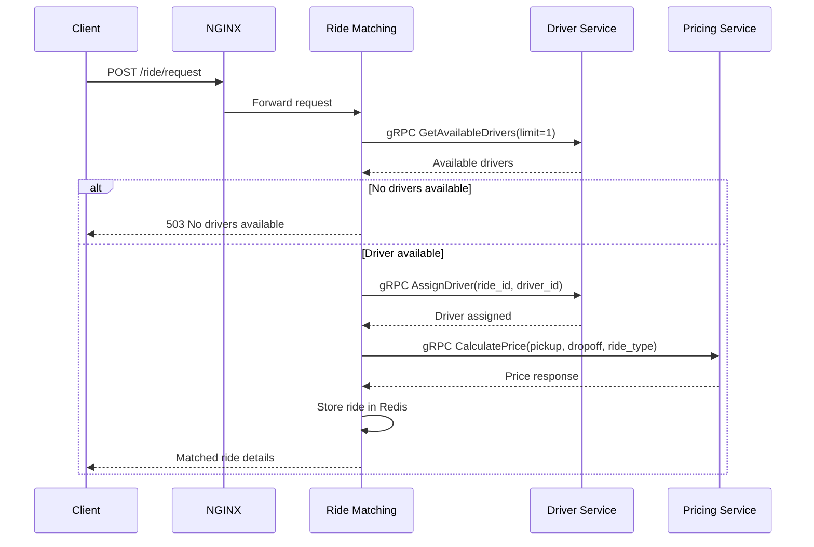
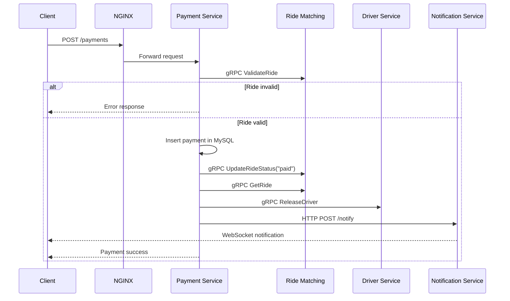

# RideBook

<div align="center">


**RideBook: A Microservices-Based Distributed Ride Booking System**

**Prepared in an MCA major project documentation style**

</div>

---

## Abstract

RideBook is a distributed ride-booking platform developed to demonstrate the practical application of microservices architecture in a real-world problem domain. The system models the core operations of an online cab booking platform, including rider management, driver management, ride allocation, fare estimation, payment processing, and real-time notifications. Instead of building the application as a monolithic system, the project decomposes the business workflow into multiple independently deployable services, each responsible for a clearly defined functional area.

The project uses FastAPI-based backend services implemented in Python, React for the frontend interface, MySQL and MongoDB for persistent storage, Redis for low-latency operational data, gRPC for internal service communication, and NGINX as an API gateway. In addition, the system incorporates Prometheus and Grafana for monitoring and a circuit breaker pattern for resilience against downstream service failures.

The primary goal of the project is to study how distributed systems can be designed with better modularity, fault isolation, observability, and scalability. As an MCA major project, RideBook serves as a complete implementation-oriented case study of modern backend architecture and cloud-native development practices.

---

## Table of Contents

- [1. Introduction](#1-introduction)
- [2. Problem Definition](#2-problem-definition)
- [3. Aim of the Project](#3-aim-of-the-project)
- [4. Objectives](#4-objectives)
- [5. Scope of the Project](#5-scope-of-the-project)
- [6. System Overview](#6-system-overview)
- [7. System Architecture](#7-system-architecture)
- [8. Service Dependency Diagram](#8-service-dependency-diagram)
- [9. Workflow Diagrams](#9-workflow-diagrams)
- [10. Module Description](#10-module-description)
- [11. Technology Stack](#11-technology-stack)
- [12. Database Design Rationale](#12-database-design-rationale)
- [13. API Gateway Design](#13-api-gateway-design)
- [14. REST API Summary](#14-rest-api-summary)
- [15. gRPC Contract Summary](#15-grpc-contract-summary)
- [16. Resilience and Monitoring](#16-resilience-and-monitoring)
- [17. Implementation Methodology](#17-implementation-methodology)
- [18. Project Setup and Execution](#18-project-setup-and-execution)
- [19. System Access Points](#19-system-access-points)
- [20. Project Directory Structure](#20-project-directory-structure)
- [21. Experimental Demonstration of Circuit Breaker](#21-experimental-demonstration-of-circuit-breaker)
- [22. Advantages of the Proposed System](#22-advantages-of-the-proposed-system)
- [23. Limitations](#23-limitations)
- [24. Future Scope](#24-future-scope)
- [25. Conclusion](#25-conclusion)

---

## 1. Introduction

The software industry has increasingly shifted from monolithic application design to distributed, service-oriented systems. This transition is driven by the need for modular development, independent deployment, better fault isolation, and improved scalability. A ride-booking application is an appropriate domain for studying distributed system design because it naturally involves multiple business processes such as customer registration, driver allocation, price computation, transaction handling, and event notifications.

RideBook has been designed as an MCA major project to explore how such a system can be implemented using modern architectural principles. The project demonstrates how different services can work together while maintaining individual responsibility, independent data ownership, and observable system behavior. The implementation is not only functional but also educational, offering insight into real distributed backend design.

---

## 2. Problem Definition

In a conventional monolithic ride-booking system, all major functionalities such as user handling, ride allocation, pricing, and payment processing are usually bundled within a single application. This leads to several practical problems:

- increased code complexity as the application grows
- difficulty in scaling specific modules independently
- tight coupling among unrelated business concerns
- reduced fault isolation when one module fails
- challenges in monitoring internal operational behavior

The problem addressed by this project is how to design and implement a ride-booking platform using microservices so that the system becomes more modular, maintainable, observable, and resilient.

---

## 3. Aim of the Project

The aim of this project is to design and implement a distributed ride-booking system using a microservices architecture, where each service independently handles a specific business capability while communicating with other services through well-defined interfaces.

---

## 4. Objectives

The main objectives of RideBook are:

- to study the use of microservices architecture in a realistic application domain
- to implement separate services for user, driver, ride, pricing, payment, and notification workflows
- to use REST APIs for external communication and gRPC for internal communication
- to demonstrate polyglot persistence using MySQL, MongoDB, and Redis
- to provide a unified access layer through an API gateway
- to implement real-time updates using WebSocket
- to add observability using Prometheus and Grafana
- to implement a circuit breaker pattern to improve fault tolerance
- to deploy and run the entire system using Docker Compose

---

## 5. Scope of the Project

The scope of this project includes the design and development of the core backend and frontend functionality required for a basic ride-booking application. It focuses on service decomposition, communication flow, state handling, payment orchestration, and monitoring. The system is intended for academic demonstration, experimentation, and architectural learning.

The project scope includes:

- rider registration and management
- driver registration and availability handling
- ride request and assignment flow
- price estimation
- payment processing and validation
- notification persistence and WebSocket-based delivery
- service monitoring and circuit breaker state observation

The project does not aim to fully replicate a commercial ride-booking platform with advanced security, geolocation, recommendation systems, route optimization, or production cloud deployment.

---

## 6. System Overview

RideBook is composed of six main business services along with infrastructure and observability components.

### Business services

- `user-service`
- `driver-service`
- `ride-matching-service`
- `pricing-service`
- `payment-service`
- `notification-service`

### Supporting components

- `frontend`
- `nginx`
- `prometheus`
- `grafana`
- `phpmyadmin`
- `mongo-express`
- `redisinsight`

The frontend interacts with the backend only through the NGINX gateway. Internally, services communicate via both REST and gRPC depending on the use case. Each service maintains control over its own data store, preserving service autonomy.

---

## 7. System Architecture

The following diagram illustrates the high-level architecture of the system:

```text
                        +------------------------------+
                        |        Client / Browser      |
                        |        React Frontend        |
                        +--------------+---------------+
                                       |
                                       | HTTP / WebSocket
                        +--------------v---------------+
                        |       NGINX API Gateway      |
                        |           Port 8080          |
                        +---+-----+-----+-----+-----+--+
                            |     |     |     |     |
                            |     |     |     |     |
                          REST  REST  REST  REST  REST
                            |     |     |     |     |
          +-----------------+     |     |     |     +------------------+
          |                       |     |     |                        |
   +------v------+         +------v------+  +--v-----------+    +------v------+
   | User Service|         | Driver Service| | Ride Matching|    | Payment     |
   |    :8001    |         | :8002 / 50052 | | :8003 / 50051|    | Service:8004|
   |   MySQL     |         |   MongoDB     | | Redis + gRPC |    |   MySQL     |
   +-------------+         +------+--------+ +------+-------+    +------+------+
                                   ^                 |                   |
                                   |                 |                   |
                                   |                 | gRPC              | HTTP
                                   |                 v                   v
                             +-----+--------+   +----+--------+   +------+------+
                             | Pricing      |   | Notification|   | Driver      |
                             | Service      |   | Service     |   | Release via  |
                             | :8006 / 50053|   | :8005       |   | gRPC         |
                             | Redis        |   | Mongo + WS  |   +-------------+
                             +--------------+   +-------------+
```

The architecture follows the principle that each service should:

- own a distinct business responsibility
- manage its own data store
- expose a stable interface
- remain independently deployable

---

## 8. Service Dependency Diagram

The dependency diagram below shows how services interact and which data stores they use.



---

## 9. Workflow Diagrams

### 9.1 Ride Request Workflow



### 9.2 Payment Workflow



---

## 10. Module Description

### 10.1 User Service

The User Service maintains rider information. It provides CRUD operations for user records and stores all rider data in MySQL.

**Functions**

- user creation
- user retrieval
- user update
- user deletion

**Endpoints**

- `GET /users`
- `GET /users/{id}`
- `POST /users`
- `PUT /users/{id}`
- `DELETE /users/{id}`
- `GET /health`

---

### 10.2 Driver Service

The Driver Service stores driver profiles and controls whether a driver is available, assigned, or released. It exposes both REST and gRPC interfaces.

**Functions**

- list and create drivers
- update availability
- provide available drivers to other services
- assign and release drivers through gRPC

**REST endpoints**

- `GET /drivers`
- `GET /drivers/available`
- `GET /drivers/{id}`
- `POST /drivers`
- `PUT /drivers/{id}/availability`
- `GET /health`

**gRPC methods**

- `GetAvailableDrivers`
- `AssignDriver`
- `ReleaseDriver`

---

### 10.3 Ride Matching Service

The Ride Matching Service is the core orchestration service. It receives ride requests, requests an available driver from the Driver Service, obtains a fare estimate from the Pricing Service, and stores ride information in Redis.

**Functions**

- accept ride requests
- coordinate driver assignment
- obtain fare calculation
- store active ride state
- expose ride details to the Payment Service
- expose circuit breaker status

**Endpoints**

- `POST /ride/request`
- `GET /ride/{id}`
- `PUT /ride/{id}/status`
- `GET /rides`
- `GET /ride/{id}/validate`
- `GET /health`
- `GET /circuit-breakers`

**gRPC methods**

- `GetRide`
- `ValidateRide`
- `UpdateRideStatus`

---

### 10.4 Payment Service

The Payment Service validates ride ownership and payment eligibility before processing transactions. It stores completed payments in MySQL, updates the ride status, releases the driver, and sends a notification to the user.

**Functions**

- validate ride before charging
- prevent duplicate payment attempts
- store payment records
- mark rides as paid
- release drivers
- send success notifications
- expose circuit breaker status

**Endpoints**

- `POST /payments`
- `GET /payments`
- `GET /payments/{id}`
- `GET /payments/user/{user_id}`
- `GET /health`
- `GET /circuit-breakers`

---

### 10.5 Notification Service

The Notification Service stores notification data in MongoDB and delivers real-time messages to connected clients using WebSocket.

**Functions**

- persist notifications
- broadcast notifications
- send user-specific notifications
- maintain WebSocket connection state

**Endpoints**

- `POST /notify`
- `GET /notifications`
- `GET /notifications/user/{user_id}`
- `GET /health`
- `WS /ws`
- `WS /ws/{user_id}`

---

### 10.6 Pricing Service

The Pricing Service calculates ride fare based on ride type, surge multiplier, and simulated distance factor. It also exposes pricing-related information over REST and gRPC.

**Functions**

- compute fare
- expose pricing rates
- expose surge information

**Endpoints**

- `POST /pricing/calculate`
- `GET /pricing/surge`
- `GET /pricing/rates`
- `GET /health`

**gRPC method**

- `CalculatePrice`

---

## 11. Technology Stack

### 11.1 Frontend Technologies

- React 18
- Axios
- HTML/CSS/JavaScript

### 11.2 Backend Technologies

- Python 3.11
- FastAPI
- Uvicorn
- gRPC
- Protocol Buffers

### 11.3 Database Technologies

- MySQL 8
- MongoDB 7
- Redis 7

### 11.4 Deployment and Infrastructure

- Docker
- Docker Compose
- NGINX

### 11.5 Monitoring and Resilience

- Prometheus
- Grafana
- Circuit breaker pattern

### 11.6 Administrative Tools

- phpMyAdmin
- Mongo Express
- RedisInsight

---

## 12. Database Design Rationale

The project adopts polyglot persistence because different modules have different storage requirements.

| Service | Database | Justification |
|---|---|---|
| User Service | MySQL | suitable for structured relational user records |
| Payment Service | MySQL | appropriate for transactional consistency and payment history |
| Driver Service | MongoDB | flexible structure for driver and vehicle details |
| Notification Service | MongoDB | effective for event-like notification records |
| Ride Matching Service | Redis | optimized for fast access to temporary ride state |
| Pricing Service | Redis | useful for caching pricing-related values |

This design reflects a major-project-level study of using the right storage engine for the right service.

---

## 13. API Gateway Design

NGINX is used as the API gateway for the system. It hides the internal network topology from the client and provides a single access point for all HTTP and WebSocket interactions.

### Gateway route mapping

| Route Prefix | Forwarded To |
|---|---|
| `/` | frontend |
| `/users` | user-service |
| `/drivers` | driver-service |
| `/ride/` | ride-matching-service |
| `/rides` | ride-matching-service |
| `/payments` | payment-service |
| `/pricing/` | pricing-service |
| `/notifications` | notification-service |
| `/notify` | notification-service |
| `/ws` | notification-service |
| `/health/*` | respective service health endpoints |

---

## 14. REST API Summary

### User APIs

```http
GET    /users
GET    /users/{id}
POST   /users
PUT    /users/{id}
DELETE /users/{id}
```

### Driver APIs

```http
GET /drivers
GET /drivers/available
GET /drivers/{id}
POST /drivers
PUT /drivers/{id}/availability?available=true|false
```

### Ride APIs

```http
POST /ride/request
GET  /ride/{id}
PUT  /ride/{id}/status
GET  /rides
```

### Payment APIs

```http
POST /payments
GET  /payments
GET  /payments/{id}
GET  /payments/user/{user_id}
```

### Notification APIs

```http
POST /notify
GET  /notifications
GET  /notifications/user/{user_id}
WS   /ws
WS   /ws/{user_id}
```

### Health APIs

```http
GET /health
GET /health/users
GET /health/drivers
GET /health/rides
GET /health/payments
GET /health/notifications
GET /health/pricing
```

---

## 15. gRPC Contract Summary

The inter-service communication schema is defined in `proto/ride.proto`.

### RideService

- `GetRide`
- `ValidateRide`
- `UpdateRideStatus`

### DriverService

- `GetAvailableDrivers`
- `AssignDriver`
- `ReleaseDriver`

### PricingService

- `CalculatePrice`

The adoption of gRPC in this project helps to demonstrate strongly typed, efficient communication between backend services.

---

## 16. Resilience and Monitoring

### 16.1 Monitoring with Prometheus

Each FastAPI service exposes a `/metrics` endpoint, which is scraped by Prometheus. These metrics provide visibility into:

- HTTP request volume
- request latency
- in-flight requests
- circuit breaker behavior
- WebSocket connection count

### 16.2 Dashboard Visualization with Grafana

Grafana is configured with a dashboard named:

```text
RideBook Observability
```

This dashboard visualizes:

- service availability
- request throughput
- error trends
- latency behavior
- circuit breaker open/closed state
- short-circuit event counts
- notification connection metrics

### 16.3 Circuit Breaker Pattern

Circuit breakers are implemented to protect critical downstream calls from repeated failure.

**Ride Matching Service breakers**

- `driver-service-grpc`
- `pricing-service-grpc`

**Payment Service breakers**

- `ride-service-validate-grpc`
- `ride-service-update-grpc`
- `ride-service-lookup-grpc`
- `driver-service-release-grpc`
- `notification-service-http`

### 16.4 Circuit Breaker Inspection

The following internal endpoints expose the current breaker state:

- `GET /circuit-breakers` in `ride-matching-service`
- `GET /circuit-breakers` in `payment-service`

These can be inspected using:

```bash
docker compose exec ride-matching-service python -c "import urllib.request; print(urllib.request.urlopen('http://localhost:8003/circuit-breakers').read().decode())"
docker compose exec payment-service python -c "import urllib.request; print(urllib.request.urlopen('http://localhost:8004/circuit-breakers').read().decode())"
```

---

## 17. Implementation Methodology

The project was implemented using an incremental and modular methodology:

1. identification of major business modules in a ride-booking system
2. decomposition of the system into separate microservices
3. selection of service-specific databases
4. implementation of REST APIs for user-facing operations
5. implementation of gRPC for internal service communication
6. integration of NGINX as the unified gateway
7. containerization of all components using Docker
8. addition of Prometheus and Grafana for monitoring
9. addition of circuit breakers for resilience testing

This methodology aligns well with MCA major project expectations because it combines system design, implementation, deployment, monitoring, and fault-handling features in one integrated solution.

---

## 18. Project Setup and Execution

### Prerequisites

- Docker Desktop
- Docker Compose

### Clone the Repository

```bash
git clone <your-repository-url>
cd ride-booking-modified
```

### Build and Start the Project

```bash
docker compose up -d --build
```

### Stop the Project

```bash
docker compose down
```

### Remove Containers and Volumes

```bash
docker compose down -v
```

---

## 19. System Access Points

### Main Application

| Component | URL |
|---|---|
| Frontend and API Gateway | `http://localhost:8080` |
| Gateway health | `http://localhost:8080/health` |

### Monitoring Components

| Component | URL |
|---|---|
| Prometheus | `http://localhost:9090` |
| Grafana | `http://localhost:3000` |

Grafana login:

```text
username: admin
password: admin
```

### Database and Cache Inspection Tools

| Tool | URL |
|---|---|
| phpMyAdmin | `http://localhost:9001` |
| Mongo Express for driver database | `http://localhost:9002` |
| Mongo Express for notification database | `http://localhost:9003` |
| RedisInsight | `http://localhost:9004` |

---

## 20. Project Directory Structure

```text
ride-booking-modified/
|-- docker-compose.yml
|-- README.md
|-- proto/
|   `-- ride.proto
|-- nginx/
|   `-- nginx.conf
|-- frontend/
|   |-- Dockerfile
|   |-- package.json
|   |-- public/
|   `-- src/
|-- user-service/
|   |-- Dockerfile
|   |-- main.py
|   `-- requirements.txt
|-- driver-service/
|   |-- Dockerfile
|   |-- main.py
|   |-- grpc_server.py
|   |-- start.sh
|   `-- requirements.txt
|-- ride-matching-service/
|   |-- Dockerfile
|   |-- main.py
|   |-- grpc_server.py
|   `-- requirements.txt
|-- payment-service/
|   |-- Dockerfile
|   |-- main.py
|   `-- requirements.txt
|-- notification-service/
|   |-- Dockerfile
|   |-- main.py
|   `-- requirements.txt
|-- pricing-service/
|   |-- Dockerfile
|   |-- main.py
|   |-- grpc_server.py
|   `-- requirements.txt
|-- monitoring/
|   |-- prometheus/
|   |   `-- prometheus.yml
|   `-- grafana/
|       `-- provisioning/
|           |-- dashboards/
|           `-- datasources/
`-- shared/
    |-- circuit_breaker.py
    `-- observability.py
```

---

## 21. Experimental Demonstration of Circuit Breaker

To demonstrate system resilience in a viva or major-project presentation, the following procedure can be used:

### Step 1. Stop the Driver Service

```bash
docker compose stop driver-service
```

### Step 2. Send Repeated Ride Requests

```bash
curl -X POST http://localhost:8080/ride/request \
  -H "Content-Type: application/json" \
  -d '{"riderId":1,"pickup":"A","dropoff":"B","ride_type":"standard"}'
```

After repeated downstream failures, the `driver-service-grpc` circuit breaker in the Ride Matching Service transitions to the `open` state.

### Step 3. Observe the State

Observe the transition using:

- Grafana dashboard
- Prometheus queries
- `/circuit-breakers` inspection endpoint

### Step 4. Restore the Service

```bash
docker compose start driver-service
```

After recovery, the breaker returns toward the `closed` state.

---

## 22. Advantages of the Proposed System

The major advantages of the proposed system are:

- clear separation of responsibilities across services
- independent data ownership
- easier modular development and maintenance
- better fault isolation than a monolithic architecture
- internal communication through well-defined contracts
- improved operational visibility through metrics and dashboards
- support for resilience testing through circuit breaker behavior
- suitability as an educational case study for distributed systems

---

## 23. Limitations

Although the project demonstrates key distributed system principles, it has the following limitations:

- no authentication and authorization module
- no secure HTTPS/TLS configuration
- no cloud deployment configuration
- no asynchronous message queue integration
- simplified pricing logic
- no real GPS or maps integration
- service recovery still depends on local Docker startup behavior

These limitations do not reduce the academic value of the project, but they indicate areas for future extension.

---

## 24. Future Scope

The system can be extended further in the following ways:

- integration of JWT-based authentication and role management
- use of Kafka or RabbitMQ for event-driven workflows
- cloud-native deployment on Kubernetes
- distributed tracing using OpenTelemetry and Jaeger
- integration with real maps and route optimization services
- payment gateway integration for real transactions
- advanced surge pricing and demand prediction
- driver location tracking and trip analytics
- service mesh integration for more advanced traffic control

---

## 25. Conclusion

RideBook successfully demonstrates the design and implementation of a microservices-based distributed ride-booking platform. The project covers multiple important concepts relevant to an MCA major project, including service decomposition, inter-service communication, database heterogeneity, API gateway routing, monitoring, and resilience engineering.

The project is valuable not only as a working software system but also as an academic study of modern backend architecture. It provides a concrete example of how distributed services can be coordinated to solve a real application problem while maintaining modularity, observability, and fault tolerance.

In summary, RideBook fulfills the goals of a major project by combining design, implementation, experimentation, and deployment into a single comprehensive system.

---

## Suggested Formal Project Description

If you need one short formal paragraph for synopsis, record submission, or viva introduction, you can use:

> "RideBook is a microservices-based distributed ride-booking system developed as an MCA major project. The system consists of independently deployable services for user management, driver management, ride matching, pricing, payment, and notification delivery. It uses FastAPI and Python for backend services, React for the frontend, gRPC for internal service communication, MySQL, MongoDB, and Redis for persistence, and Docker Compose for deployment. The project further integrates Prometheus, Grafana, and circuit breaker mechanisms to demonstrate observability and resilience in distributed systems."

---

## License

Add the appropriate license before publishing the repository externally.
