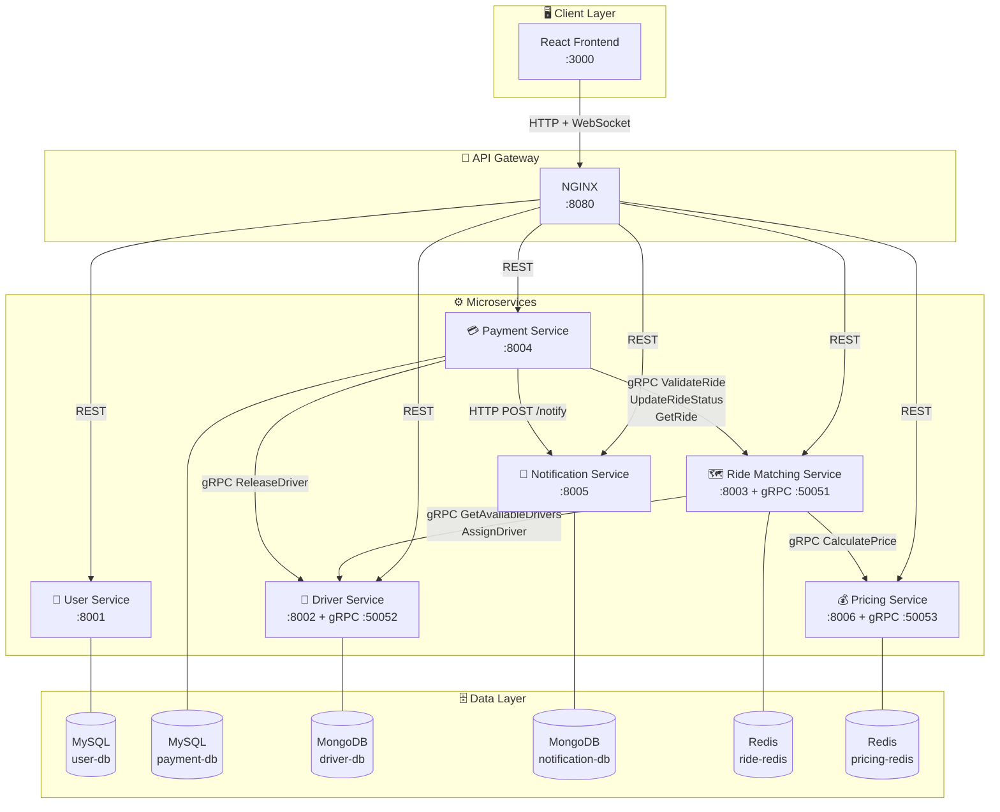
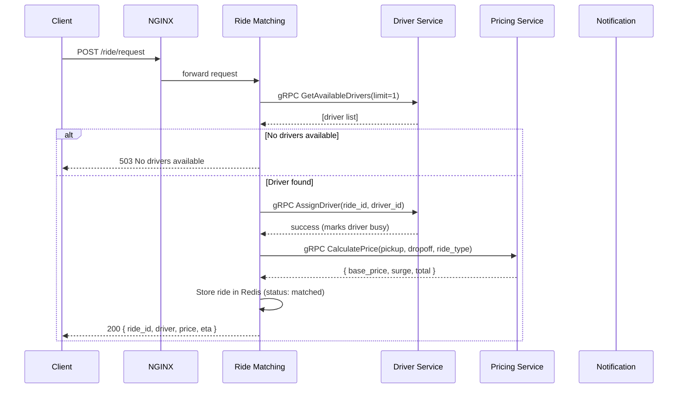
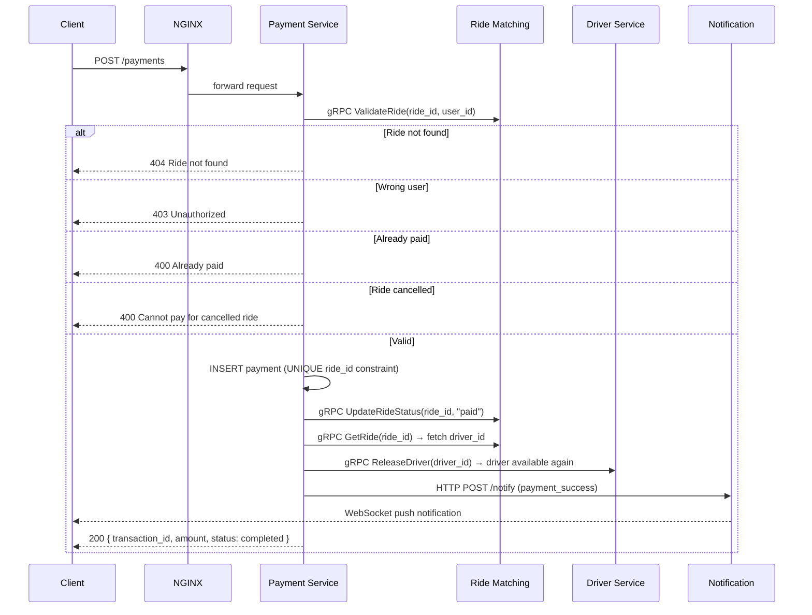

# 🚗 RideBook — Distributed Microservices Platform

<div align="center">


<!--  -->


A production-grade ride-booking backend built with **6 independent microservices**, **4 different databases**, **gRPC inter-service communication**, **WebSocket notifications**, and an **NGINX API gateway** — all orchestrated with Docker Compose.

</div>

---

## 📑 Table of Contents

- [Architecture Overview](#-architecture-overview)
- [Services](#-services)
- [Service Dependency Map](#-service-dependency-map)
- [Communication Flow](#-communication-flow)
- [Database Architecture](#-database-architecture)
- [API Reference](#-api-reference)
- [Validation & Business Rules](#-validation--business-rules)
- [Getting Started](#-getting-started)
- [Port Reference](#-port-reference)
- [Tech Stack](#-tech-stack)

---

## 🏗 Architecture Overview

RideBook follows a **polyglot microservices architecture** where each service owns its data, communicates via gRPC for internal calls, and exposes REST APIs through a central NGINX gateway.

```
                        ┌─────────────────────────────┐
                        │         CLIENT / BROWSER     │
                        │         React Frontend       │
                        └──────────────┬──────────────┘
                                       │ HTTP / WebSocket
                        ┌──────────────▼──────────────┐
                        │        NGINX API GATEWAY     │
                        │          Port 8080           │
                        └──┬───┬───┬───┬───┬───┬──────┘
                           │   │   │   │   │   │
              REST ────────┘   │   │   │   │   └──── REST
         ┌─────────┐    ┌──────┘   └──────┐    ┌─────────┐
         │  User   │    │  Ride Matching  │    │ Payment │
         │ Service │    │    Service      │    │ Service │
         │  :8001  │    │     :8003       │    │  :8004  │
         │ MySQL   │    │  Redis + gRPC   │    │  MySQL  │
         └─────────┘    └──┬──────────┬──┘    └────┬────┘
                           │ gRPC     │ gRPC        │ gRPC
                    ┌──────┘          └──────┐      │
               ┌────▼────┐           ┌───────▼─┐   │
               │ Driver  │           │ Pricing │   │
               │ Service │           │ Service │   │
               │  :8002  │           │  :8006  │   │
               │MongoDB  │           │  Redis  │   │
               └─────────┘           └─────────┘   │
                                                    │ HTTP
                                          ┌─────────▼───────┐
                                          │  Notification   │
                                          │    Service      │
                                          │     :8005       │
                                          │ MongoDB + WS    │
                                          └─────────────────┘
```

---

## 🧩 Services

### 1. 👤 User Service — `port 8001`
Manages rider accounts and authentication.

| Detail | Value |
|--------|-------|
| Framework | FastAPI |
| Database | MySQL 8.0 |
| Container | `user-service` |
| DB Container | `user-db` |
| Communication | REST only |

**Endpoints:** `GET /users` · `POST /users` · `GET /users/{id}`

---

### 2. 🚗 Driver Service — `port 8002 · gRPC 50052`
Manages driver profiles, availability status, and assignment.

| Detail | Value |
|--------|-------|
| Framework | FastAPI + gRPC server |
| Database | MongoDB 7.0 |
| Container | `driver-service` |
| DB Container | `driver-db` |
| Communication | REST (public) + gRPC (internal) |

**REST Endpoints:** `GET /drivers` · `GET /drivers/available` · `POST /drivers` · `PUT /drivers/{id}/availability`

**gRPC Methods:**
- `GetAvailableDrivers(limit)` — returns available drivers
- `AssignDriver(ride_id, driver_id)` — marks driver as busy (atomic, race-condition safe)
- `ReleaseDriver(driver_id, ride_id)` — frees driver after trip completion, increments `total_rides`

---

### 3. 🗺 Ride Matching Service — `port 8003 · gRPC 50051`
Core ride orchestration service. Matches riders with drivers, stores ride state in Redis, and exposes gRPC for payment validation.

| Detail | Value |
|--------|-------|
| Framework | FastAPI + gRPC server |
| Database | Redis 7.2 |
| Container | `ride-matching-service` |
| DB Container | `ride-redis` |
| Communication | REST (public) + gRPC (internal, caller and callee) |

**REST Endpoints:** `POST /ride/request` · `GET /ride/{id}` · `GET /rides` · `PUT /ride/{id}/status`

**gRPC Methods (exposes):**
- `GetRide(ride_id)` — fetch full ride data
- `ValidateRide(ride_id, user_id, amount)` — validates ownership + payability
- `UpdateRideStatus(ride_id, status)` — updates ride state

**gRPC Methods (calls):**
- → `driver-service:50052` · `GetAvailableDrivers`, `AssignDriver`
- → `pricing-service:50053` · `CalculatePrice`

---

### 4. 💳 Payment Service — `port 8004`
Handles payment processing with full validation chain — verifies ride ownership, prevents duplicate payments, releases driver after successful payment.

| Detail | Value |
|--------|-------|
| Framework | FastAPI |
| Database | MySQL 8.0 |
| Container | `payment-service` |
| DB Container | `payment-db` |
| Communication | REST (public) + gRPC (caller) |

**REST Endpoints:** `POST /payments` · `GET /payments` · `GET /payments/{id}` · `GET /payments/user/{user_id}`

**gRPC Calls:**
- → `ride-matching-service:50051` · `ValidateRide`, `UpdateRideStatus`, `GetRide`
- → `driver-service:50052` · `ReleaseDriver`

---

### 5. 🔔 Notification Service — `port 8005`
Stores notifications in MongoDB and broadcasts real-time events to connected clients via WebSocket.

| Detail | Value |
|--------|-------|
| Framework | FastAPI + WebSocket |
| Database | MongoDB 7.0 |
| Container | `notification-service` |
| DB Container | `notification-db` |
| Communication | REST (public) + WebSocket |

**Endpoints:** `POST /notify` · `GET /notifications` · `WS /ws`

---

### 6. 💰 Pricing Service — `port 8006 · gRPC 50053`
Calculates ride prices with surge multipliers, caches results in Redis.

| Detail | Value |
|--------|-------|
| Framework | FastAPI + gRPC server |
| Database | Redis 7.2 |
| Container | `pricing-service` |
| DB Container | `pricing-redis` |
| Communication | REST (public) + gRPC (internal) |

**gRPC Methods:**
- `CalculatePrice(pickup, dropoff, ride_type)` — returns base price, surge multiplier, total

---

## 🔗 Service Dependency Map



---

## 🔄 Communication Flow

### Ride Request Flow



---

### Payment Flow



---

## 🗄 Database Architecture

| Service | Database | Type | Why |
|---------|----------|------|-----|
| User Service | `user-db` | MySQL 8.0 | Relational user accounts, strong consistency |
| Payment Service | `payment-db` | MySQL 8.0 | ACID transactions, financial data integrity |
| Driver Service | `driver-db` | MongoDB 7.0 | Flexible driver profiles, variable vehicle data |
| Notification Service | `notification-db` | MongoDB 7.0 | Schema-less event logs, flexible notification types |
| Ride Matching Service | `ride-redis` | Redis 7.2 | In-memory speed for real-time ride state (TTL: 1hr) |
| Pricing Service | `pricing-redis` | Redis 7.2 | Price caching, surge multiplier storage |

---

## 📡 API Reference

All endpoints are proxied through NGINX at `http://localhost:8080`.

### Users
```
GET    /users              → List all users
POST   /users              → Create user
GET    /users/{id}         → Get user by ID
```

### Drivers
```
GET    /drivers            → List all drivers
GET    /drivers/available  → List available drivers only
POST   /drivers            → Register new driver
PUT    /drivers/{id}/availability?available=true|false
```

### Rides
```
POST   /ride/request       → Request a ride (triggers driver assignment)
GET    /ride/{id}          → Get ride details
GET    /rides              → List all rides (from Redis)
PUT    /ride/{id}/status   → Update ride status
```

### Payments
```
POST   /payments           → Process payment (full validation chain)
GET    /payments           → List all payments
GET    /payments/{id}      → Get payment by ID
GET    /payments/user/{id} → Get payments by user
```

### Notifications
```
POST   /notify             → Send notification (internal)
GET    /notifications      → List notifications
WS     /ws                 → WebSocket connection for real-time events
```

### Health Checks
```
GET    /health/users        → User service health
GET    /health/drivers      → Driver service health
GET    /health/rides        → Ride matching health
GET    /health/payments     → Payment service health
GET    /health/notifications → Notification service health
GET    /health/pricing      → Pricing service health
```

---

## ✅ Validation & Business Rules

### Ride Request Validations
| Rule | Response |
|------|----------|
| No drivers available | `503 No drivers available at the moment` |
| Driver becomes unavailable mid-assignment | `503 Driver became unavailable` |
| Driver service unreachable | `503 Driver service unavailable` |

### Payment Validations
| Rule | Response |
|------|----------|
| Ride does not exist | `404 Ride not found` |
| `user_id` doesn't match ride's `rider_id` | `403 Unauthorized: ride belongs to different user` |
| Ride already paid | `400 Ride already paid` |
| Ride already completed | `400 Ride already completed` |
| Ride is cancelled | `400 Cannot pay for cancelled ride` |
| Duplicate payment (race condition) | `400 Payment already processed` (DB UNIQUE constraint) |

### Post-Payment Side Effects (automatic)
1. Ride status → `"paid"` (via gRPC `UpdateRideStatus`)
2. Driver status → `available: true`, `total_rides++` (via gRPC `ReleaseDriver`)
3. Notification pushed to user via WebSocket

---

## 🚀 Getting Started

### Prerequisites
- Docker Desktop
- Docker Compose

### Run the project

```bash
git clone <your-repo-url>
cd ride-booking-modified

docker compose build
docker compose up -d
```

### Access the app

| Interface | URL |
|-----------|-----|
| Frontend Dashboard | http://localhost:8080 |
| API Gateway | http://localhost:8080 |

### Tear down

```bash
docker compose down -v   # -v removes volumes (wipes databases)
```

---

## 🔌 Port Reference

| Container | Internal Port | Exposed | Protocol |
|-----------|--------------|---------|----------|
| `nginx-gateway` | 8080 | **8080** | HTTP |
| `user-service` | 8001 | internal | HTTP |
| `driver-service` | 8002 | internal | HTTP |
| `driver-service` | 50052 | internal | gRPC |
| `ride-matching-service` | 8003 | internal | HTTP |
| `ride-matching-service` | 50051 | internal | gRPC |
| `payment-service` | 8004 | internal | HTTP |
| `notification-service` | 8005 | internal | HTTP + WS |
| `pricing-service` | 8006 | internal | HTTP |
| `pricing-service` | 50053 | internal | gRPC |
| `user-db` | 3306 | internal | MySQL |
| `payment-db` | 3306 | internal | MySQL |
| `driver-db` | 27017 | internal | MongoDB |
| `notification-db` | 27017 | internal | MongoDB |
| `ride-redis` | 6379 | internal | Redis |
| `pricing-redis` | 6379 | internal | Redis |

---

## 🛠 Tech Stack

| Layer | Technology |
|-------|-----------|
| Frontend | React 18, Axios, WebSocket API |
| API Gateway | NGINX 1.25 |
| Backend Framework | FastAPI (Python 3.11) |
| Inter-service Communication | gRPC (Protocol Buffers) |
| Relational Database | MySQL 8.0 |
| Document Database | MongoDB 7.0 |
| Cache / State Store | Redis 7.2 |
| Containerization | Docker + Docker Compose |
| gRPC Tooling | `grpcio`, `grpcio-tools` |
| Validation | Pydantic v2 |

---

## 📁 Project Structure

```
ride-booking/
├── docker-compose.yml
├── nginx/
│   └── nginx.conf               # API gateway routing rules
├── proto/
│   └── ride.proto               # Shared gRPC service definitions
├── frontend/
│   ├── Dockerfile
│   ├── src/App.js               # React dashboard (single-page)
│   └── nginx-frontend.conf
├── user-service/
│   ├── main.py                  # FastAPI app, MySQL
│   └── requirements.txt
├── driver-service/
│   ├── main.py                  # FastAPI app, MongoDB
│   ├── grpc_server.py           # gRPC: GetAvailableDrivers, AssignDriver, ReleaseDriver
│   └── start.sh                 # Starts both FastAPI + gRPC server
├── ride-matching-service/
│   ├── main.py                  # FastAPI app, Redis
│   ├── grpc_server.py           # gRPC: GetRide, ValidateRide, UpdateRideStatus
│   └── start.sh
├── payment-service/
│   ├── main.py                  # FastAPI app, MySQL, calls gRPC
│   └── requirements.txt
├── notification-service/
│   ├── main.py                  # FastAPI + WebSocket, MongoDB
│   └── requirements.txt
└── pricing-service/
    ├── main.py                  # FastAPI app, Redis
    ├── grpc_server.py           # gRPC: CalculatePrice
    └── start.sh
```

---

<div align="center">
  <sub>Built with FastAPI · gRPC · Redis · MySQL · MongoDB · React · NGINX · Docker</sub>
</div>