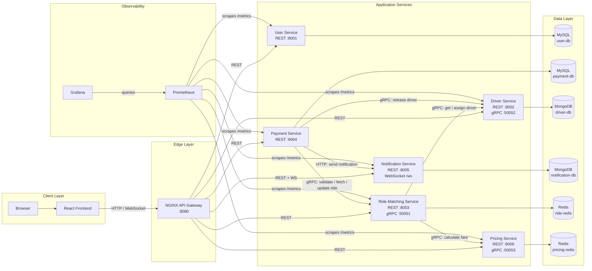
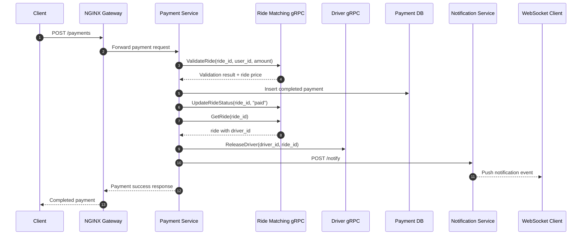

# RideBook

<div align="center">


A distributed ride-booking platform built to demonstrate a practical microservices architecture with REST, gRPC, WebSockets, polyglot persistence, circuit breakers, and end-to-end observability.

</div>

## Overview

RideBook models the core workflow of a cab booking system:

- users can be created and managed
- drivers are stored independently and exposed through REST and gRPC
- rides are matched through a dedicated orchestration service
- fares are calculated by a pricing service
- payments are validated and finalized through a separate payment service
- notifications are persisted in MongoDB and pushed over WebSockets

The repository is structured as a multi-service system behind an NGINX gateway. The frontend talks only to the gateway, while internal service-to-service communication uses gRPC and HTTP where appropriate.

## Highlights

- Microservices split by business capability: user, driver, ride matching, pricing, payment, notification
- API gateway with centralized routing through NGINX
- REST for north-south traffic and gRPC for internal synchronous calls
- Polyglot persistence:
  - MySQL for users and payments
  - MongoDB for drivers and notifications
  - Redis for ride state and pricing cache
- Real-time notification delivery using WebSockets
- Prometheus metrics on every service and a pre-provisioned Grafana dashboard
- Circuit breaker protection in ride matching and payment service integrations
- Full local environment with Docker Compose and service GUI tools

## Architecture

### High-Level System Diagram



### Service Responsibilities

| Service | Main responsibility | Storage | External interface |
| --- | --- | --- | --- |
| `user-service` | Rider CRUD | MySQL | REST |
| `driver-service` | Driver CRUD, availability, assignment, release | MongoDB | REST + gRPC |
| `ride-matching-service` | Create and manage rides, orchestrate match flow | Redis | REST + gRPC |
| `pricing-service` | Fare and surge calculation, short-lived caching | Redis | REST + gRPC |
| `payment-service` | Payment processing, ride validation, driver release | MySQL | REST |
| `notification-service` | Notification persistence and live delivery | MongoDB | REST + WebSocket |
| `frontend` | Operator/demo UI | none | Browser app |
| `nginx` | Gateway and reverse proxy | none | HTTP entry point |

## Flow Diagrams

### Ride Request Flow


### Payment Completion Flow



## Tech Stack

| Layer | Technology |
| --- | --- |
| Frontend | React 18, Axios |
| API / Services | FastAPI, Python 3 |
| Internal RPC | gRPC, Protocol Buffers |
| Gateway | NGINX |
| SQL storage | MySQL 8 |
| Document storage | MongoDB 7 |
| Cache / ephemeral state | Redis 7 |
| Monitoring | Prometheus, Grafana |
| Local orchestration | Docker Compose |

## Repository Structure

```text
.
|-- frontend/
|-- nginx/
|-- proto/
|-- shared/
|-- user-service/
|-- driver-service/
|-- ride-matching-service/
|-- pricing-service/
|-- payment-service/
|-- notification-service/
|-- monitoring/
`-- docker-compose.yml
```

## Getting Started

### Prerequisites

- Docker
- Docker Compose

### Run the Full System

```bash
docker compose up --build
```

Once the stack is healthy, open:

| Component | URL |
| --- | --- |
| Application / Gateway | `http://localhost:8080` |
| Prometheus | `http://localhost:9090` |
| Grafana | `http://localhost:3000` |
| phpMyAdmin | `http://localhost:9001` |
| Mongo Express `driver-db` | `http://localhost:9002` |
| Mongo Express `notification-db` | `http://localhost:9003` |
| RedisInsight | `http://localhost:9004` |

### Default GUI Credentials

| Tool | Username | Password |
| --- | --- | --- |
| Grafana | `admin` | `admin` |
| Mongo Express | `admin` | `admin123` |
| phpMyAdmin | `root` | `password` |

## API Surface

The gateway exposes the main application routes:

| Capability | Route prefix |
| --- | --- |
| Users | `/users` |
| Drivers | `/drivers` |
| Ride management | `/ride`, `/rides` |
| Pricing | `/pricing` |
| Payments | `/payments` |
| Notifications | `/notifications`, `/notify`, `/ws` |
| Health checks | `/health`, `/health/users`, `/health/drivers`, `/health/rides`, `/health/payments`, `/health/notifications`, `/health/pricing` |

### Example Requests

Create a ride:

```bash
curl -X POST http://localhost:8080/ride/request \
  -H "Content-Type: application/json" \
  -d "{\"riderId\":1,\"pickup\":\"Campus\",\"dropoff\":\"Railway Station\",\"ride_type\":\"standard\"}"
```

Process a payment:

```bash
curl -X POST http://localhost:8080/payments \
  -H "Content-Type: application/json" \
  -d "{\"rideId\":\"ride-12345678\",\"userId\":1,\"amount\":25.0,\"payment_method\":\"card\"}"
```

Open a WebSocket connection:

```text
ws://localhost:8080/ws
ws://localhost:8080/ws/1
```

## Internal Contracts

The protocol buffer definition in `proto/ride.proto` defines three gRPC services:

- `RideService`
  - `GetRide`
  - `ValidateRide`
  - `UpdateRideStatus`
- `DriverService`
  - `GetAvailableDrivers`
  - `AssignDriver`
  - `ReleaseDriver`
- `PricingService`
  - `CalculatePrice`

## Observability and Resilience

### Metrics

Each FastAPI service exposes Prometheus metrics at `/metrics`, including:

- request count, latency, and in-flight request gauges
- circuit breaker state, transitions, and call outcomes
- active notification WebSocket connections

### Circuit Breakers

Circuit breakers are implemented in shared code and currently protect downstream calls in:

- `ride-matching-service`
  - `driver-service-grpc`
  - `pricing-service-grpc`
- `payment-service`
  - ride validation, ride lookup, ride update
  - driver release
  - notification delivery

Operational snapshots are available at:

- `/circuit-breakers` on `ride-matching-service`
- `/circuit-breakers` on `payment-service`

## Development Notes

- The services bootstrap their schemas or seed data on startup.
- Ride records are stored in Redis with a one-hour TTL.
- Pricing responses are cached briefly in Redis.
- The current implementation is optimized for local demonstration and academic architecture study rather than production-grade security or cloud deployment.

## Why This Repo Is Useful

RideBook is a compact reference implementation for learning how multiple backend services interact in a realistic workflow. It is especially useful for understanding:

- service decomposition and data ownership
- gateway-based routing
- REST plus gRPC hybrid communication
- live notifications with WebSockets
- observability in distributed systems
- resilience patterns such as circuit breakers

## License

This repository does not currently include a license file. Add one if you intend to distribute or reuse the project outside its current academic context.
