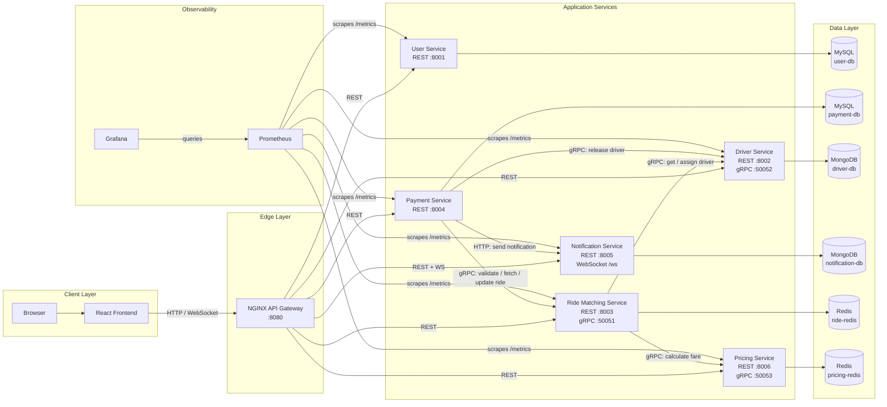
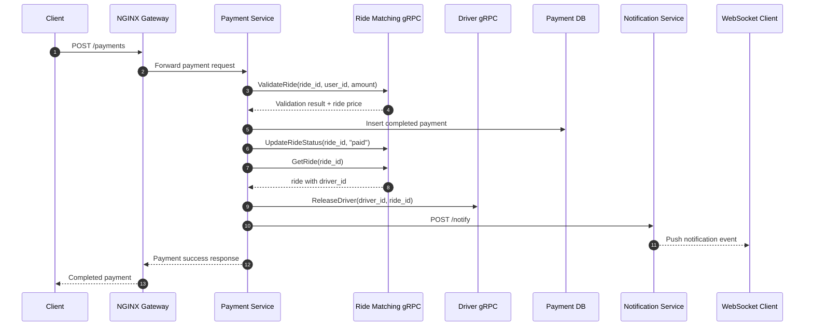

# RideBook

<div align="center">


**RideBook: A Microservices-Based Distributed Ride Booking System**

**Prepared in an MCA major project documentation style**

</div>

## Overview

RideBook models the core workflow of a cab booking system:

- users can be created and managed
- drivers are stored independently and exposed through REST and gRPC
- rides are matched through a dedicated orchestration service
- fares are calculated by a pricing service
- payments are validated and finalized through a separate payment service
- notifications are persisted in MongoDB and pushed over WebSockets

The repository is structured as a multi-service system behind an NGINX gateway. The frontend talks only to the gateway, while internal service-to-service communication uses gRPC and HTTP where appropriate.

## Highlights

- Microservices split by business capability: user, driver, ride matching, pricing, payment, notification
- API gateway with centralized routing through NGINX
- REST for north-south traffic and gRPC for internal synchronous calls
- Polyglot persistence:
  - MySQL for users and payments
  - MongoDB for drivers and notifications
  - Redis for ride state and pricing cache
- Real-time notification delivery using WebSockets
- Prometheus metrics on every service and a pre-provisioned Grafana dashboard
- Circuit breaker protection in ride matching and payment service integrations
- Full local environment with Docker Compose and service GUI tools

## Architecture

### High-Level System Diagram



### Service Responsibilities

| Service | Main responsibility | Storage | External interface |
| --- | --- | --- | --- |
| `user-service` | Rider CRUD | MySQL | REST |
| `driver-service` | Driver CRUD, availability, assignment, release | MongoDB | REST + gRPC |
| `ride-matching-service` | Create and manage rides, orchestrate match flow | Redis | REST + gRPC |
| `pricing-service` | Fare and surge calculation, short-lived caching | Redis | REST + gRPC |
| `payment-service` | Payment processing, ride validation, driver release | MySQL | REST |
| `notification-service` | Notification persistence and live delivery | MongoDB | REST + WebSocket |
| `frontend` | Operator/demo UI | none | Browser app |
| `nginx` | Gateway and reverse proxy | none | HTTP entry point |

## Flow Diagrams

### Ride Request Flow


### Payment Completion Flow



## Tech Stack

| Layer | Technology |
| --- | --- |
| Frontend | React 18, Axios |
| API / Services | FastAPI, Python 3 |
| Internal RPC | gRPC, Protocol Buffers |
| Gateway | NGINX |
| SQL storage | MySQL 8 |
| Document storage | MongoDB 7 |
| Cache / ephemeral state | Redis 7 |
| Monitoring | Prometheus, Grafana |
| Local orchestration | Docker Compose |

## Repository Structure

```text
.
|-- frontend/
|-- nginx/
|-- proto/
|-- shared/
|-- user-service/
|-- driver-service/
|-- ride-matching-service/
|-- pricing-service/
|-- payment-service/
|-- notification-service/
|-- monitoring/
`-- docker-compose.yml
```

## Getting Started

### Prerequisites

- Docker
- Docker Compose

### Run the Full System

```bash
git clone <your-repository-url>
cd ride-booking-modified
```

### Build and Start the Project

```bash
docker compose up -d --build
```

Once the stack is healthy, open:

| Component | URL |
| --- | --- |
| Application / Gateway | `http://localhost:8080` |
| Prometheus | `http://localhost:9090` |
| Grafana | `http://localhost:3000` |
| phpMyAdmin | `http://localhost:9001` |
| Mongo Express `driver-db` | `http://localhost:9002` |
| Mongo Express `notification-db` | `http://localhost:9003` |
| RedisInsight | `http://localhost:9004` |

---

## 20. Project Directory Structure

```text
ride-booking-modified/
|-- docker-compose.yml
|-- README.md
|-- proto/
|   `-- ride.proto
|-- nginx/
|   `-- nginx.conf
|-- frontend/
|   |-- Dockerfile
|   |-- package.json
|   |-- public/
|   `-- src/
|-- user-service/
|   |-- Dockerfile
|   |-- main.py
|   `-- requirements.txt
|-- driver-service/
|   |-- Dockerfile
|   |-- main.py
|   |-- grpc_server.py
|   |-- start.sh
|   `-- requirements.txt
|-- ride-matching-service/
|   |-- Dockerfile
|   |-- main.py
|   |-- grpc_server.py
|   `-- requirements.txt
|-- payment-service/
|   |-- Dockerfile
|   |-- main.py
|   `-- requirements.txt
|-- notification-service/
|   |-- Dockerfile
|   |-- main.py
|   `-- requirements.txt
|-- pricing-service/
|   |-- Dockerfile
|   |-- main.py
|   |-- grpc_server.py
|   `-- requirements.txt
|-- monitoring/
|   |-- prometheus/
|   |   `-- prometheus.yml
|   `-- grafana/
|       `-- provisioning/
|           |-- dashboards/
|           `-- datasources/
`-- shared/
    |-- circuit_breaker.py
    `-- observability.py
```

---

## 21. Experimental Demonstration of Circuit Breaker

To demonstrate system resilience in a viva or major-project presentation, the following procedure can be used:

### Step 1. Stop the Driver Service

```bash
docker compose stop driver-service
```

### Step 2. Send Repeated Ride Requests

```bash
curl -X POST http://localhost:8080/ride/request \
  -H "Content-Type: application/json" \
  -d "{\"riderId\":1,\"pickup\":\"Campus\",\"dropoff\":\"Railway Station\",\"ride_type\":\"standard\"}"
```

Process a payment:

```bash
curl -X POST http://localhost:8080/payments \
  -H "Content-Type: application/json" \
  -d "{\"rideId\":\"ride-12345678\",\"userId\":1,\"amount\":25.0,\"payment_method\":\"card\"}"
```

Open a WebSocket connection:

```text
ws://localhost:8080/ws
ws://localhost:8080/ws/1
```

## Internal Contracts

The protocol buffer definition in `proto/ride.proto` defines three gRPC services:

- `RideService`
  - `GetRide`
  - `ValidateRide`
  - `UpdateRideStatus`
- `DriverService`
  - `GetAvailableDrivers`
  - `AssignDriver`
  - `ReleaseDriver`
- `PricingService`
  - `CalculatePrice`

## Observability and Resilience

### Metrics

Each FastAPI service exposes Prometheus metrics at `/metrics`, including:

- no authentication and authorization module
- no secure HTTPS/TLS configuration
- no cloud deployment configuration
- no asynchronous message queue integration
- simplified pricing logic
- no real GPS or maps integration
- service recovery still depends on local Docker startup behavior

These limitations do not reduce the academic value of the project, but they indicate areas for future extension.

---

## 24. Future Scope

The system can be extended further in the following ways:

- integration of JWT-based authentication and role management
- use of Kafka or RabbitMQ for event-driven workflows
- cloud-native deployment on Kubernetes
- distributed tracing using OpenTelemetry and Jaeger
- integration with real maps and route optimization services
- payment gateway integration for real transactions
- advanced surge pricing and demand prediction
- driver location tracking and trip analytics
- service mesh integration for more advanced traffic control

---

## 25. Conclusion

RideBook successfully demonstrates the design and implementation of a microservices-based distributed ride-booking platform. The project covers multiple important concepts relevant to an MCA major project, including service decomposition, inter-service communication, database heterogeneity, API gateway routing, monitoring, and resilience engineering.

The project is valuable not only as a working software system but also as an academic study of modern backend architecture. It provides a concrete example of how distributed services can be coordinated to solve a real application problem while maintaining modularity, observability, and fault tolerance.

In summary, RideBook fulfills the goals of a major project by combining design, implementation, experimentation, and deployment into a single comprehensive system.

---

## Suggested Formal Project Description

If you need one short formal paragraph for synopsis, record submission, or viva introduction, you can use:

> "RideBook is a microservices-based distributed ride-booking system developed as an MCA major project. The system consists of independently deployable services for user management, driver management, ride matching, pricing, payment, and notification delivery. It uses FastAPI and Python for backend services, React for the frontend, gRPC for internal service communication, MySQL, MongoDB, and Redis for persistence, and Docker Compose for deployment. The project further integrates Prometheus, Grafana, and circuit breaker mechanisms to demonstrate observability and resilience in distributed systems."

---

## License

Add the appropriate license before publishing the repository externally.
